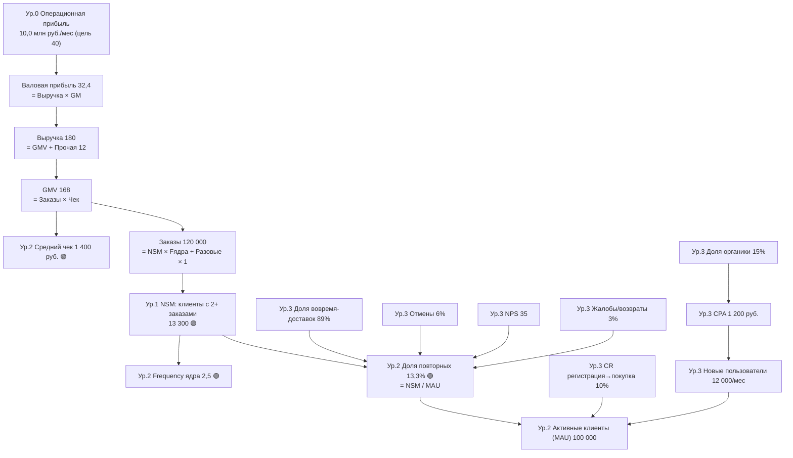

# ДЗ 2. Часть 3. Дерево метрик - сервис TechGourmet

## 1. Структура дерева

Дерево построено от бизнес-результата (уровень 0) до рычагов (уровень 3). NSM из части 2 ("клиенты с 2+ заказами в месяц") - уровень 1: она напрямую порождает заказы и далее по финансовой цепочке - прибыль. Уровень 2 - продуктовые факторы NSM, уровень 3 - операционные и маркетинговые рычаги, которыми команда управляет напрямую. 🟢 - приоритетные метрики (максимальное влияние на NSM и цель, см. п. 3).

Связи "вверх" (как NSM двигает бизнес-цель): NSM × Fядра + Разовые = Заказы → × Чек = GMV → + Прочая = Выручка → × GM = Валовая прибыль → − OPEX = Прибыль. Каждое звено - формула, цепочка замкнута.

## 2. Метрики: значения и формулы связи

| Ур. | Метрика | Текущее значение | Формула связи с уровнем выше |
|---|---|---|---|
| 0 | Операционная прибыль | 10,0 млн руб./мес (цель 40) | = Валовая прибыль − OPEX |
| 0ф | Валовая прибыль | 32,4 млн руб. | = Выручка × Gross Margin (18%) |
| 0ф | Постоянные OPEX | 22,4 млн руб. | ограничение, не рычаг (допущение части 1) |
| 0ф | Выручка | 180 млн руб. | = GMV + Прочая выручка |
| 0ф | Gross Margin | 18% | = Валовая прибыль / Выручка |
| 1 | **NSM (клиенты с 2+ заказами)** 🟢 | **13 300** | = MAU × Доля повторных |
| 2 | 🟢 Доля повторных клиентов | 13,3% | = NSM / MAU; управляется качеством первого опыта и механиками лояльности |
| 2 | 🟢 Frequency ядра (заказов у клиента 2+) | 2,5/мес | = (Заказы − MAU) / NSM |
| 2 | Активные клиенты (MAU) | 100 000 | = Новые платящие + Удержанные/реактивированные |
| 2 | 🟢 Средний чек | 1 400 руб. | = GMV / Заказы |
| 2 | Заказы | 120 000 | = NSM × Fядра + (MAU − NSM) × 1 |
| 3 | Доля вовремя-доставок | 89% | input-метрика качества → Доля повторных (с лагом 2-4 недели) |
| 3 | Доля отмен | 6% | input → Доля повторных, GM (компенсации) |
| 3 | NPS | 35 | input → Доля повторных (guardrail из части 2) |
| 3 | Доля жалоб/возвратов | 3% | input → Доля повторных |
| 3 | CR регистрация → первая покупка | 10% | = Новые платящие / Новые пользователи → MAU |
| 3 | Новые пользователи | 12 000/мес | input; = 1 200 платящих при CR 10% → MAU |
| 3 | CPA | 1 200 руб. | = Маркетинговые затраты / Новые платящие → стоимость роста MAU |
| 3 | Доля органического трафика | 15% | input → эффективный CPA → стоимость роста MAU |

Итого 18 метрик, 4 уровня (0, 1, 2, 3 + финансовая цепочка 0ф).

### Декомпозиция NSM (математика)

Оценка текущего значения NSM из баланса заказов: разовые клиенты делают 1 заказ, повторные - Fядра; тогда NSM = (Заказы − MAU) / (Fядра − 1) = (120 000 − 100 000) / 1,5 = **13 300** при Fядра = 2,5 (допущение, выведенное из брифа: частота 1,2 в среднем по базе возможна только при ядре заметно выше среднего). Проверка: 13 300 × 2,5 + 86 700 × 1 = 119 950 ≈ 120 000 заказов - сходится.

Финансовая цепочка в базе: 120 000 × 1 400 = 168 млн GMV + 12 = 180 Выручка × 18% = 32,4 Валовая прибыль − 22,4 OPEX = 10,0 Прибыль - сходится с частью 1.

Целевое состояние (из цели части 1: MAU 112 000, заказы 188 160): доля повторных должна вырасти с 13,3% до ~45%, то есть **NSM 13 300 → ~50 800 (+282%)**. Именно так цель по frequency читается через NSM: рост частоты базы достигается переводом разовых клиентов в повторные (retention в поведенческой форме, см. часть 2).

## 3. Влияние +10% метрик уровней 2-3 на NSM и бизнес-цель

Расчет: изменяем одну метрику на +10%, остальные фиксируем; эффект идет по формулам дерева. Для "Доли повторных" и NSM перевод разового клиента в повторный добавляет 1,5 заказа (2,5 − 1).

| Метрика (уровень) | Δ NSM | Δ прибыли | Эластичность прибыли | Комментарий |
|---|---|---|---|---|
| 🟢 Доля повторных 13,3→14,6% (2) | **+10,0%** | +5,0% | 0,50 | единственный прямой рычаг NSM: +1 330 повторных клиентов |
| 🟢 NSM ×1,10 (1) | +10,0% (по постр.) | +5,0% | 0,50 | то же через увеличение самого пула ядра |
| 🟢 Frequency ядра 2,5→2,75 (2) | 0% | +8,4% | 0,84 | глубже вовлечение ядра: +3 325 заказов |
| MAU ×1,10 = +10 000 клиентов (2) | +10,0%* | +30,2% | 3,02 | *при пропорциональном росте доли повторных; дорого: ~12 млн руб./мес маркетинга по CPA |
| 🟢 Средний чек ×1,10 (2) | 0% | +30,2% | 3,02 | чистый денежный рычаг, NSM не двигает |
| CR рег→покупка 10→11% (3) | 0% (лаг) | ~+0,3% | ~0,03 | +120 новых платящих/мес; эффект на NSM с отставанием на 1-2 месяца |
| Новые пользователи ×1,10 (3) | 0% (лаг) | ~+0,3% | ~0,03 | верх воронки; влияние на NSM только будущие периоды |
| Операционные рычаги: вовремя 89→98%, отмены 6→5,4%, NPS +10%, жалобы 3→2,7% (3) | не считается численно | не считается численно | - | входные метрики качества; влияние на Долю повторных измеряется экспериментами (гипотезы части 4) |
| CPA / органика (3) | 0% | косвенно через стоимость роста MAU | - | снижение CPA улучшает юнит-экономику привлечения, на NSM текущего месяца не влияет |

**Приоритетные метрики (максимальное влияние):** 🟢 **Доля повторных** - единственный рычаг, дающий +10% к NSM при разумных усилиях (эластичность к прибыли 0,50 при том, что именно она выражает стратегию лояльности); 🟢 **Frequency ядра** (эл. 0,84) - второй рычаг вовлечения ядра; 🟢 **Средний чек** (эл. 3,02) - крупнейший денежный рычаг без затрат на привлечение. MAU сознательно не в приоритете: при LTV/CAC ≈ 0,4 (часть 1) платный рост базы разрушает экономику - база +12%/год задается умеренно.

## 4. Проверка дерева (проход вверх)

**Цепочка 1 - операционная метрика 3-го уровня:** Доля вовремя-доставок 89% → (качество первого опыта) → Доля повторных 13,3% → NSM 13 300 → Заказы 120 000 → GMV 168 → Выручка 180 → Валовая прибыль 32,4 → Прибыль 10,0 (цель 40). До NSM - 2 шага, до бизнес-цели - финансовая цепочка из формул, обрывов нет.

**Цепочка 2 - маркетинговая метрика:** Доля органики 15% → CPA 1 200 руб. → Новые платящие 1 200/мес → MAU 100 000 → (доля повторных 13,3%) → NSM → ... → Прибыль. Замкнута.

**Цепочка 3 - целевое состояние:** Доля повторных 45% → NSM 50 800 → Заказы 188 160 → GMV 276,6 → Выручка 288,6 → ВП 63,5 (GM 22%) → Прибыль 41,1 млн/мес = +311% к цели части 1. Сходится с мостом роста из части 1.

## 5. Выводы

1. Дерево замкнуто: 18 метрик, 4 уровня, каждая связь - формула; база сходится с брифом (10,0 млн прибыли), целевое состояние - с целью части 1 (+311% run-rate).
2. Главный рычаг стратегии - Доля повторных (13,3% → 45%): это и есть NSM-выражение лояльности; ее рост одновременно двигает frequency, LTV/CAC и прибыль.
3. Операционные метрики (вовремя, отмены, жалобы, NPS) - input-метрики 3-го уровня: их эластичность к NSM измеряется экспериментами и становится гипотезами части 4; они же - источники guardrail-метрик.
